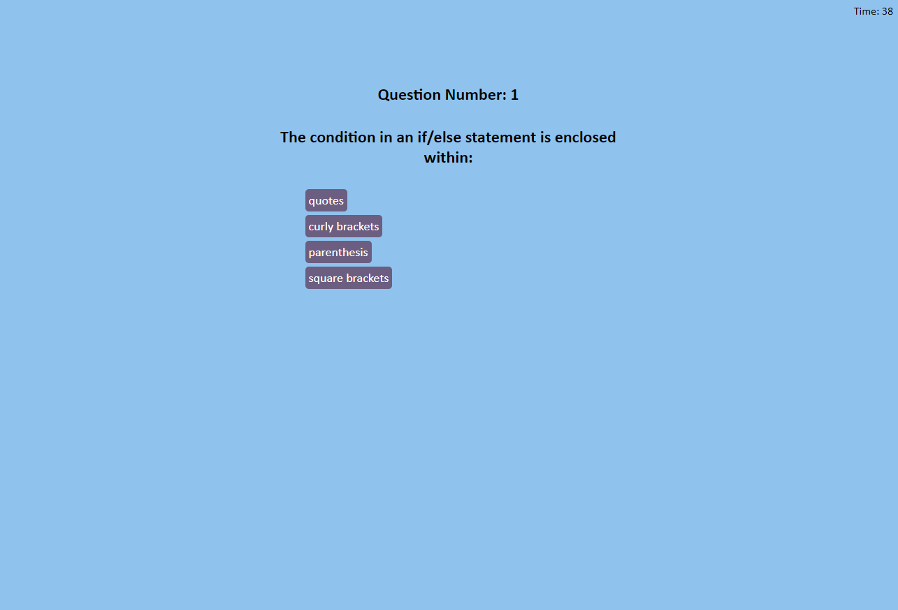

# code-quiz
Challenge - 4 multiple choice timed coding quiz

## Description

I created a timed code quiz with 5 questions that the user has 4 multiple choice answers to choose from. The score the user receives is the final time remaining at the time if answering the last questions, however every wrong answer deducts 10 seconds from the timer. The game also records the users score withing a high score page that will retain the collection of local high scores until cleared. I ended up using multiple JavaScript files only to help myself manage what I was trying to do with the code, I could pretty simply be combined into 1 file

## Motivation

I wanted to use JavaScript to perform the main logic of the quiz, but also utilize JavaScript to alter attributes within the JavaScript functions.   

## Comments

I have added comments to more easily understand the JavaScript code that I added to perform all requested features asked to be included.

## Screenshot

 

Application: https://jcgilbert70.github.io/code-quiz/

Repository: https://github.com/jcgilbert70/code-quiz.git

## Credits

N/A

## License

Please refer to the LISCENSE in the repo